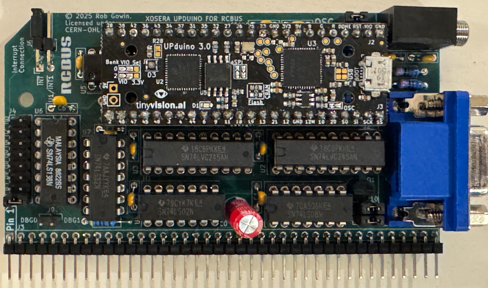
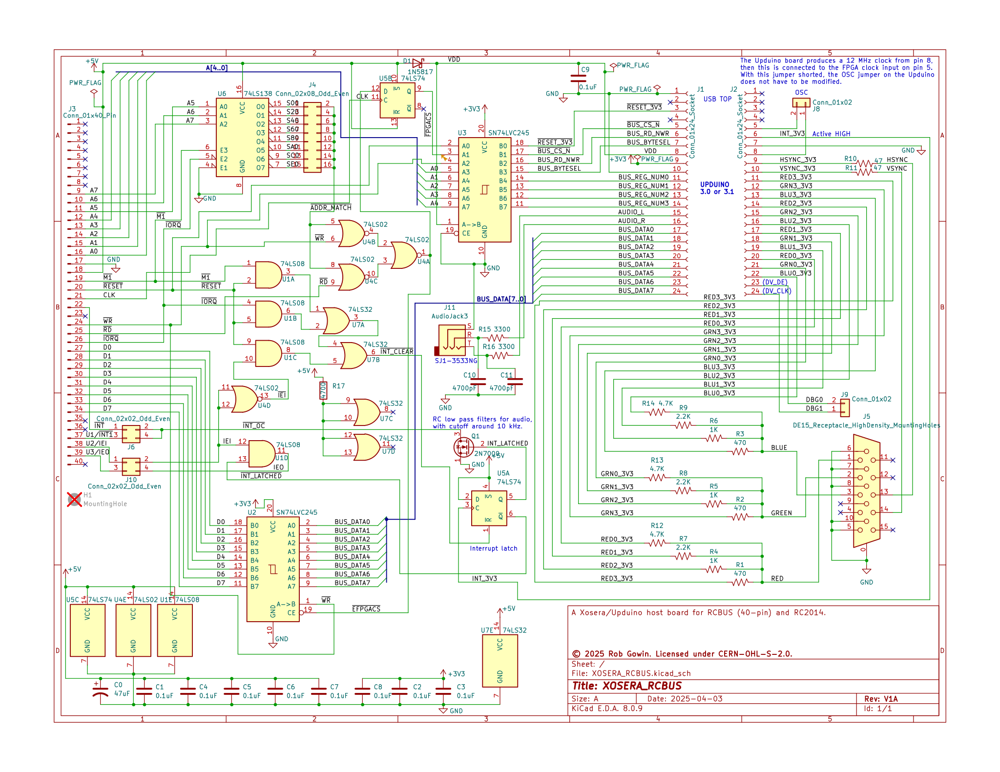
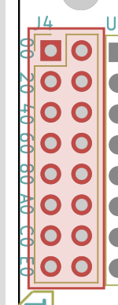
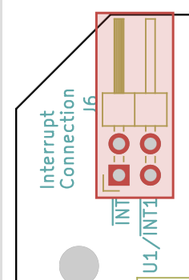
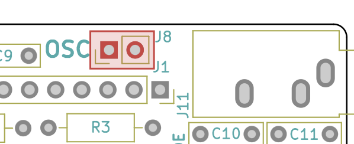
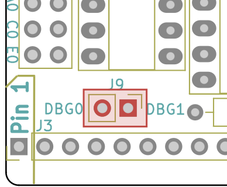
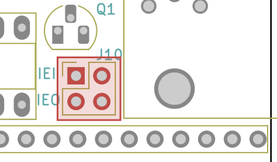

[Xosera](https://github.com/XarkLabs/Xosera) is an FPGA based "retro" graphics adapter created by @Xark. Check out the link to see all of its features. Xosera was originally designed for the rosco_m68k single board computer and the bus interface for that board. But, Xosera features a simple 8-bit data bus with a few control signals.  So, this project is a "port" of Xosera to the [RCBus](https://smallcomputercentral.com/rcbus/) bus interface. 

## Table of Contents
* [Hardware Documentation](#hardware-documentation)
  * [Schematic](#schematic)
  * [Connectors](#connectors)
  * [Jumpers](#jumpers)
  * [Bill of Materials](#bill-of-materials)
* [Programming the FPGA](#progamming-the-fpga)
* [Acknowledgements](#acknowledgements)

## Hardware Documentation

### Schematic

The board was created using [Kicad](https://www.kicad.org) version 8.0.

Click the image below to download a PDF version of the schematic.

### Connectors

| Reference | Comment                      |
| --------- | ---------------------------- |
| J3        | 40-pin RCBus connector       |
| J5        | Female VGA monitor connector |
| J11       | Audio Jack                   |

### Jumpers

| Reference |                                                          | Description                   | Comment                                                      |
| --------- | -------------------------------------------------------- | ----------------------------- | ------------------------------------------------------------ |
| J4        |     | I/O Address decode            | The J4 jumper block controls where in the Z80 I/O space the XOSERA_RCBUS board will appear. The Xosera interface requires 32 bytes of I/O addresses, and can be configured to appear at I/O addresses 0x00-0x1F, 0x20-0x3F, 0x40-0x5F, 0x60-0x7F, 0x80-0x9F, 0xA0-0xBF, 0xC0-0xDF or 0xE0-0xFF |
| J6        |     | Interrupt connection to RCBus | The board can generate a single interrupt Xosera. Jumper the left two pins of J6 to use the /INT RCBus signal (pin 22) or the right two pins to use the RCBus USER1/INT1 signal (pin 37). |
| J8        |    | Upduino clock                 | This jumper must be closed for proper operation.             |
| J9        |    | Xosera debug pin              | Leave this jumper open under normal operation.               |
| J10       |  | IEI/IEO signals.              | Add two horizontal jumpers. These jumpers connect the XOSERA_RCBUS board to the RCBus system IEI/IEO  signals. Normally required. |

The default I/O address setting for this board is 0xA0.

## Bill of Materials (BOM)

[Text file parts list](XOSERA_RCBUS_mouser.txt) for pasting into the [Mouser BOM tool](https://www.mouser.com/Bom/CopyPaste) (login required).

Check out the [interactive BOM](https://htmlpreview.github.io/?https://raw.githubusercontent.com/codesmythe/XOSERA_RCBUS/refs/heads/main/XOSERA_RCBUS_V1A_ibom.html)
for the board.

To obtain a KEMOJO PCB, download these [Gerbers](https://raw.githubusercontent.com/codesmythe/XOSERA_RCBUS/refs/heads/main/XOSERA_RCBUS.zip) for use at your preferred PCB manufacturer. I use JLCPCB.

| Component Type     | Reference                  | Qty | Description                                                                                                                  | Part                                                                                     |
| ------------------ | -------------------------- | --- | ---------------------------------------------------------------------------------------------------------------------------- | ---------------------------------------------------------------------------------------- |
| FPGA Dev Board | (Plugs into J1 & J2) | 1 | Upduino 3.1 low cost Lattice iCE40 FPGA board | Purchase from [TinyVision.ai site](https://tinyvision.ai/products/fpga-development-board-upduino-v3-1) or [Tindie](https://www.tindie.com/products/tinyvision_ai/upduino-v31-low-cost-lattice-ice40-fpga-board/?pt=ac_prod_search) |
| Capacitor          | C0                         |   1 | 47uF, Electrolytic, 2.5mm Pitch                                                                                              | Mouser [710-860020673013](https://www.mouser.com/ProductDetail/710-860020673013)         |
| Capacitor          | C1-C9 |   9 | 0.1 uF, MLCC, 5 mm Pitch                                                                                                     | Mouser [594-K104K15X7RF5TH5](https://www.mouser.com/ProductDetail/594-K104K15X7RF5TH5)   |
| Capacitor          | C10,C11                    |   2 | 4700pF, MLCC, 5 mm Pitch                                                                                                     | Mouser [594-K472K10X7RF5UH5](https://www.mouser.com/ProductDetail/594-K472K10X7RF5UH5)   |
| Diode              | D1                         |   1 | 1N5817                                                                                                                       | Mouser [511-1N5817](https://www.mouser.com/ProductDetail/511-1N5817)                     |
| Socket             | J1,J2                      |   2 | 1x24 female pin socket                                                                                                       | Mouser [517-929850-01-26-RA](https://www.mouser.com/ProductDetail/517-929850-01-26-RA)   |
| Connector          | J3                         |   1 | 1x40 right angle pin header                                                                                                  | Mouser [710-61304011021](https://www.mouser.com/ProductDetail/710-61304011021)           |
| Jumper Block       | J4                         |   1 | 2x8 straight pin header                                                                                                      | Mouser [200-TSW10807TD](https://www.mouser.com/ProductDetail/200-TSW10807TD)             |
| Connector          | J5                         |   1 | Female VGA connector | Mouser [523-7HDE15SD1CH4FVGA](https://www.mouser.com/ProductDetail/523-7HDE15SD1CH4FVGA) |
| Jumper Block       | J6                         |   1 | 2x2 right angle pin header                                                                                                   | Mouser [710-61300421021](https://www.mouser.com/ProductDetail/710-61300421021)           |
| Jumper             | J8,J9                      |   2 | 1x2 straight pin header                                                                                                      | Mouser [571-5-146268-1](https://www.mouser.com/ProductDetail/571-5-146268-1)             |
| Jumper Block       | J10                        |   1 | 2x2 straight pin header                                                                                                      | Mouser [737-PH2-04-UA](https://www.mouser.com/ProductDetail/737-PH2-04-UA)               |
| Connector          | J11                        |   1 | 3-pin Audio Jack, no switches                                                                                                | Mouser [SJ1-3533NG](https://www.mouser.com/ProductDetail/SJ1-3533NG)                     |
| Transistor         | Q1                         |   1 | 2N7000  MOSFET in TO92                                         | Mouser [512-2N7000](https://www.mouser.com/ProductDetail/512-2N7000)                     |
| Resistor           | R1,R2,R3                   |   3 | 470 ohm, axial, 1% tolerance, 1/4 W                                                                                          | Mouser [603-MFR-25FTF52-470R](https://www.mouser.com/ProductDetail/603-MFR-25FTF52-470R) |
| Resistor           | R4,R5,R6                   |   3 | 1K ohm, axial, 1% tolerance, 1/4 W                                                                                           | Mouser [603-MFR-25FTF52-1K](https://www.mouser.com/ProductDetail/603-MFR-25FTF52-1K)     |
| Resistor           | R7,R8,R9                   |   3 | 2.2K ohm, axial, 1% tolerance, 1/4 W                                                                                         | Mouser [603-MFR-25FTF52-2K2](https://www.mouser.com/ProductDetail/603-MFR-25FTF52-2K2)   |
| Resistor           | R10,R11                    |   2 | 47 ohm, axial, 1% tolerance, 1/4 W                                                                                           | Mouser [603-MFR-25FTF52-47R](https://www.mouser.com/ProductDetail/603-MFR-25FTF52-47R)   |
| Resistor           | R12,R13,R14,R17            |  4 | 4.7K ohm, axial, 1% tolerance, 1/4 W                                                                                         | Mouser [603-MFR-25FTF52-4K7](https://www.mouser.com/ProductDetail/603-MFR-25FTF52-4K7)   |
| Resistor           | R15,R16                    |   2 | 3.3K ohm, axial, 1% tolerance, 1/4 W                                                                                         | Mouser [603-MFR-25FRF52-3K3](https://www.mouser.com/ProductDetail/603-MFR-25FRF52-3K3)   |
| Integrated Circuit | U1                         |   1 | 74LS08 quad 2-input AND in 14-pin DIP                                                                                        | Mouser [595-SN74LS08N](https://www.mouser.com/ProductDetail/595-SN74LS08N)               |
| Integrated Circuit | U2,U3                      |   2 | 74LVC245 octal bus transceiver in 20-pin DIP                                                                                 | Mouser [595-SN74LVC245ANE4](https://www.mouser.com/ProductDetail/595-SN74LVC245ANE4)     |
| Integrated Circuit | U4                         |   1 | 74LS02 quad 2-pin NOR in 14-pin DIP                                                                                          | Mouser [595-SN74LS02N](https://www.mouser.com/ProductDetail/595-SN74LS02N)               |
| Integrated Circuit | U5                         |   1 | 74LS74 dual D flip flops in 14-pin DIP                                                                                       | Mouser [595-SN74LS74ANE4](https://www.mouser.com/ProductDetail/595-SN74LS74ANE4)         |
| Integrated Circuit | U6                         |   1 | 74LS138 3 to 8 decoder in 16-pin DIP                                                                                         | Mouser [595-SN74LS138N](https://www.mouser.com/ProductDetail/595-SN74LS138N)             |
| Integrated Circuit | U7                         |   1 | 74LS32 quad 2-pin OR in 14-pin DIP                                                                                           | Mouser [595-SN74LS32N](https://www.mouser.com/ProductDetail/595-SN74LS32N)               |
| Socket             | Sockets for U1,U4,U5,U7    |   4 | 14-pin DIP socket                                                                                                            | Mouser [571-1-2199298-3](https://www.mouser.com/ProductDetail/571-1-2199298-3)           |
| Socket             | Sockets for U2,U3           |   2 | 20-pin DIP socket                                                                                                            | Mouser [571-1-2199298-6](https://www.mouser.com/ProductDetail/571-1-2199298-6)           |
| Socket             | Socket for U6              |   1 | 16-pin DIP socket                                                                                                            | Mouser [571-1-2199298-4](https://www.mouser.com/ProductDetail/571-1-2199298-4)           |

## Programming the FPGA

The FPGA development board used by the Xosera graphics adapter is the [Upduino 3.1](https://tinyvision.ai/products/fpga-development-board-upduino-v3-1), which hosts a Lattice ICE40UP5K FPGA.

First, you will need the binary for the tool that actually does the programming, which is `iceprog.` This is available from the OSS CAD Suite tools. Download the Suite for your platform (Mac, Linux or Windows) from [here](https://github.com/YosysHQ/oss-cad-suite-build/releases).

Next, you will need the Xosera bitstream to load into the FPGA on the Upduino board. The bitstream is available 
[here](https://github.com/XarkLabs/Xosera/blob/develop/xosera_gateware/xosera_board_vga.bin). (Click on the "Download raw file" button third from right.). This file should be saved as `xosera_board_vga.bin`. 

For Windows, you will need the correct USB drivers. Installing those drivers is beyond the scope of this document, but relevant information can be found [here](https://github.com/FPGAwars/libftdi-cross-builder/wiki#driver-installation).

Then for any of the three platforms, at a command line prompt, use the `iceprog` (or `iceprog.exe`) program from the ISS Cad Suite to send the bitstream to the FPGA:

    $ iceprog -d i:0x0403:0x6014 xosera_board_vga.bin

## Acknowledgements

@Xark for creating the excellent Xosera project.

@roscopeco for designing the rosco_m68k Xosera [host board](https://github.com/rosco-m68k/hardware-projects/tree/master/xosera), from which I cribbed some of this design.

@lfantoniosi for his [tn_vdp](https://github.com/lfantoniosi/tn_vdp) project, from which I also borrowed a few ideas.
